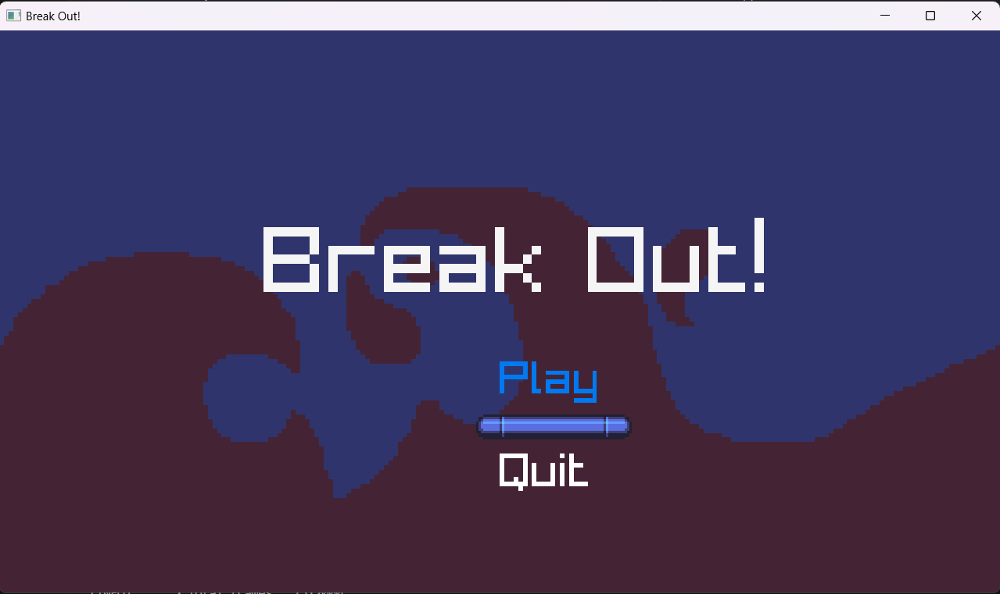

# Breakout Game

- Welcome to the Breakout Game, This is a remake for the classic arcade game where the player controls a paddle to bounce a ball and break bricks. The objective is to break all the bricks without letting the ball fall off the screen.

- This remake is recreated in Raylib in C++ learned from CS50 Game Development Course

- Original code in the course is in LÖVE 2D which supports systems like Particle Systems, for this project I created my own Particle System

## Start Screen

## Play Screen

## Complete Screen

## Lose Screen

